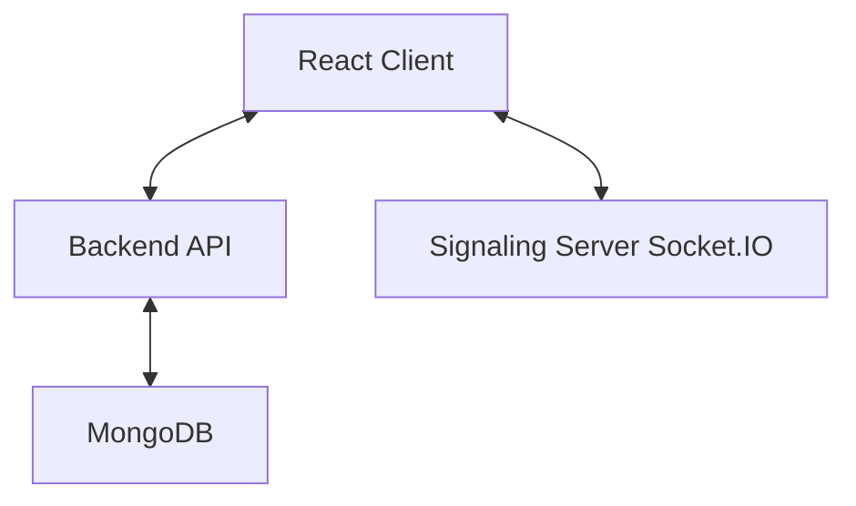

# Gethory

[](https://www.google.com/search?q=https://github.com/kira14102005/gethory)
[](https://www.google.com/search?q=LICENSE)
[](https://hub.docker.com/r/rrai21/mynextappimage)
[](https://www.google.com/search?q=CONTRIBUTING.md)
[](https://www.typescriptlang.org/)
[](https://reactjs.org/)
[](https://nodejs.org/)

Real-time WebRTC voice rooms with public/private access.

## Table of Contents

  - [Overview](https://www.google.com/search?q=%23overview)
  - [Architecture](https://www.google.com/search?q=%23architecture)
  - [Tech Stack](https://www.google.com/search?q=%23tech-stack)
  - [Prerequisites](https://www.google.com/search?q=%23prerequisites)
  - [Getting Started](https://www.google.com/search?q=%23getting-started)
  - [Configuration](https://www.google.com/search?q=%23configuration)
  - [Running Locally](https://www.google.com/search?q=%23running-locally)
  - [Docker and Compose](https://www.google.com/search?q=%23docker-and-compose)
  - [Deployment](https://www.google.com/search?q=%23deployment)
  - [Security](https://www.google.com/search?q=%23security)
  - [Usage](https://www.google.com/search?q=%23usage)
  - [API Reference](https://www.google.com/search?q=%23api-reference)
  - [Testing](https://www.google.com/search?q=%23testing)
  - [Performance](https://www.google.com/search?q=%23performance)
  - [Troubleshooting](https://www.google.com/search?q=%23troubleshooting)
  - [Roadmap](https://www.google.com/search?q=%23roadmap)
  - [Contributing](https://www.google.com/search?q=%23contributing)
  - [License](https://www.google.com/search?q=%23license)
  - [Acknowledgments](https://www.google.com/search?q=%23acknowledgments)

## Overview

Gethory is a full-stack web application that allows users to create and join real-time audio chat rooms. It's designed for seamless communication, offering both public and private rooms to suit different needs. The core of the application is built on WebRTC for peer-to-peer audio communication, with a Node.js backend and a React frontend.

### Core Features

  * **Real-time Audio:** High-quality, low-latency audio communication using WebRTC.
  * **Public and Private Rooms:** Create public rooms for anyone to join, or private rooms for invite-only conversations.
  * **User Authentication:** Secure user authentication with email verification.
  * **User Profiles:** Customizable user profiles with avatars and personal information.
  * **Dockerized Environment:** The entire application is containerized with Docker, making it easy to set up and run in any environment.

## Architecture

Gethory follows a classic client-server architecture, with a few key components working together to provide real-time communication.



### WebRTC Flow

1.  **Initiation:** A user creates or joins a room, which connects them to the Socket.IO signaling server.
2.  **Signaling:** When a new user joins a room, the signaling server notifies the other users in the room.
3.  **Peer Connection:** The users in the room establish a direct peer-to-peer connection using WebRTC.
4.  **ICE Candidates:** The users exchange ICE (Interactive Connectivity Establishment) candidates through the signaling server to find the best path for communication.
5.  **Session Description:** The users exchange SDP (Session Description Protocol) offers and answers to agree on the communication parameters.
6.  **Audio Stream:** Once the peer connection is established, the audio is streamed directly between the users, without passing through the server.

<!-- end list -->

```mermaid
sequenceDiagram
    participant ClientA
    participant SignalingServer
    participant ClientB

    ClientA->>SignalingServer: Join Room
    SignalingServer-->>ClientA: Joined
    ClientB->>SignalingServer: Join Room
    SignalingServer-->>ClientB: Joined
    SignalingServer->>ClientA: New Peer (ClientB)
    ClientA->>ClientB: Offer (SDP)
    ClientB->>ClientA: Answer (SDP)
    ClientA->>ClientB: ICE Candidate
    ClientB->>ClientA: ICE Candidate
    ClientA<->>ClientB: Peer-to-Peer Audio Stream
```

## Tech Stack

| Category | Technology |
| --- | --- |
| **Frontend** | React, Redux, TypeScript, Tailwind CSS |
| **Backend** | Node.js, Express |
| **Database** | MongoDB |
| **Realtime** | WebRTC, Socket.IO |
| **Containerization**| Docker, Docker Compose |
| **Cloud** | AWS (EC2, S3, RDS) |

## Prerequisites

  * Node.js (v18 or higher)
  * npm (v8 or higher)
  * Docker
  * Docker Compose

## Getting Started

### 1\. Clone the Repository

```bash
git clone https://github.com/kira14102005/gethory.git
cd gethory
```

### 2\. Set Up Environment Variables

Create a `.env` file in the `backend` directory and add the following:

```
# backend/.env

# Server Configuration
PORT=8000
APP_ORIGIN=http://localhost:3000

# Database
DATABASE_URL=mongodb://mongo:27017/gethory

# JWT
JWT_ACCESS_SECRET=your_access_secret
JWT_REFRESH_SECRET=your_refresh_secret

# Email (Resend)
RESEND_API_KEY=your_resend_api_key
```

### 3\. Run with Docker Compose

```bash
docker-compose up --build
```

This will start the frontend, backend, and MongoDB containers.

  * Frontend: `http://localhost:3000`
  * Backend: `http://localhost:8000`

## Configuration

All configuration is managed through environment variables in the `backend/.env` file.

| Variable | Description | Default Value |
| --- | --- | --- |
| `PORT` | The port the backend server will run on. | `8000` |
| `APP_ORIGIN` | The URL of the frontend application. | `http://localhost:3000` |
| `DATABASE_URL` | The connection string for the MongoDB database.| `mongodb://mongo:27017/gethory`|
| `JWT_ACCESS_SECRET` | The secret key for signing JWT access tokens.| `your_access_secret` |
| `JWT_REFRESH_SECRET` | The secret key for signing JWT refresh tokens.| `your_refresh_secret` |
| `RESEND_API_KEY` | The API key for the Resend email service. | `your_resend_api_key` |

## Running Locally

To run the application locally without Docker, you'll need to start the frontend and backend servers separately.

### Backend

```bash
cd backend
npm install
npm run dev
```

### Frontend

```bash
cd frontend
npm install
npm run dev
```

## Docker and Compose

The `docker-compose.yml` file defines the three services that make up the application:

  * `frontend`: The React client, served by Nginx.
  * `backend`: The Node.js API server.
  * `mongo`: The MongoDB database.

To build and run the services, use the following command:

```bash
docker-compose up --build
```

To stop the services, use:

```bash
docker-compose down
```

## Deployment

While there are no specific deployment scripts in this repository, here's a general guide for deploying the application to AWS:

1.  **Build Docker Images:** Build the frontend and backend Docker images.
2.  **Push to a Registry:** Push the images to a container registry, such as Amazon ECR.
3.  **Set up a Database:** Create a MongoDB database, either with Amazon DocumentDB or on an EC2 instance.
4.  **Deploy to EC2:**
      * Create an EC2 instance.
      * Install Docker and Docker Compose.
      * Create a `docker-compose.yml` file on the instance, using the images from your container registry.
      * Run `docker-compose up -d`.

## Security

  * **Authentication:** User authentication is handled with JWTs. The backend issues access and refresh tokens, which are stored in cookies on the client.
  * **Authorization:** The backend uses middleware to protect routes, ensuring that only authenticated users can access certain resources.
  * **Email Verification:** New users must verify their email address before they can log in.
  * **CORS:** The backend uses the `cors` middleware to restrict requests to the frontend URL.

## Usage

1.  **Sign up:** Create a new account.
2.  **Verify your email:** Check your email for a verification link.
3.  **Log in:** Log in with your new account.
4.  **Create a room:** Create a new room, either public or private.
5.  **Join a room:** Join an existing room.
6.  **Start chatting:** Once you're in a room, you can start chatting with other users.

## API Reference

### REST API

The backend provides a RESTful API for managing users, rooms, and authentication.

| Endpoint | Method | Description |
| --- | --- | --- |
| `/api/auth/register` | `POST` | Register a new user. |
| `/api/auth/login` | `POST` | Log in a user. |
| `/api/auth/logout` | `POST` | Log out a user. |
| `/api/rooms` | `GET` | Get a list of all rooms. |
| `/api/rooms` | `POST` | Create a new room. |
| `/api/rooms/:id` | `GET` | Get a single room by ID. |

### Socket.IO Events

The backend uses Socket.IO for real-time communication between the clients.

| Event | Direction | Description | Payload |
| --- | --- | --- | --- |
| `join` | Client -\> Server | A user joins a room. | `{ roomId: string, user: object }` |
| `leave` | Client -\> Server | A user leaves a room. | `{ roomId: string }` |
| `relay-ice` | Client -\> Server -\> Client | A user sends an ICE candidate to another user. | `{ peerId: string, icecandidate: object }` |
| `relay-sdp` | Client -\> Server -\> Client | A user sends an SDP offer or answer to another user. | `{ peerId: string, sessionDescription: object }` |
| `ice-candidate` | Server -\> Client | The server sends an ICE candidate to a user. | `{ peerId: string, icecandidate: object }` |
| `session-description` | Server -\> Client | The server sends an SDP offer or answer to a user. | `{ peerId: string, sessionDescription: object }` |
| `add-peer` | Server -\> Client | The server notifies a user that a new peer has joined the room. | `{ peerId: string, createOffer: boolean, user: object }` |
| `remove-peer` | Server -\> Client | The server notifies a user that a peer has left the room. | `{ peerId: string }` |
| `mute` | Client -\> Server | A user mutes their microphone. | `{ roomId: string, userId: string }` |
| `unmute` | Client -\> Server | A user unmutes their microphone. | `{ roomId: string, userId: string }` |
| `mute-info` | Server -\> Client | The server notifies a user that another user has muted or unmuted their microphone. | `{ userId: string, mute: boolean }` |

## Testing

TODO: Add instructions on how to run tests.

## Performance

The application is designed to be performant, with a focus on low-latency audio communication. The use of WebRTC for peer-to-peer communication means that the server is not a bottleneck, and the audio is streamed directly between the clients.

## Troubleshooting

  * **No audio:** If you're not getting any audio, make sure you've given the browser permission to access your microphone.
  * **Can't connect:** If you can't connect to a room, make sure the backend server is running and that you've configured the frontend to connect to the correct URL.

## Roadmap

  * Video chat
  * Text chat
  * Screen sharing

## Contributing

Contributions are welcome\! Please read the [contributing guide](https://www.google.com/search?q=CONTRIBUTING.md) for more information.

## License

This project is licensed under the MIT License. See the [LICENSE](https://www.google.com/search?q=LICENSE) file for details.

## Acknowledgments

  * [React](https://reactjs.org/)
  * [Node.js](https://nodejs.org/)
  * [Socket.IO](https://socket.io/)
  * [WebRTC](https://webrtc.org/)
