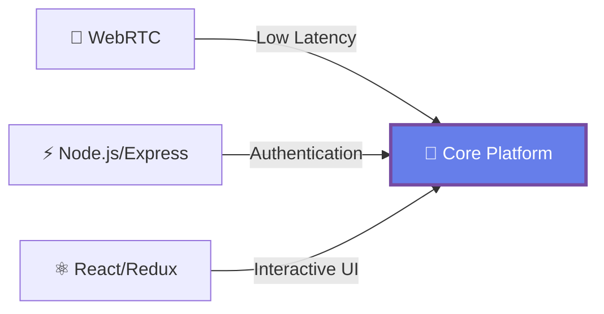
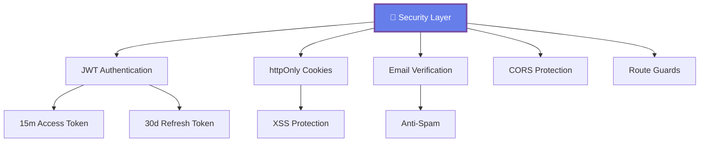

# 🎙️ Gethory

> Real-time WebRTC voice rooms with public/private access

[](https://opensource.org/licenses/MIT)
[](https://nodejs.org/)
[](https://www.docker.com/)
[](https://www.typescriptlang.org/)

Gethory is a full-stack web application meticulously designed for seamless, low-latency audio communication. It offers robust, secure user authentication, customizable user profiles, and a fully containerized environment for consistent deployments.

---

## 📋 Table of Contents

- [✨ Overview](#-overview)
- [🎨 User Interface](#-user-interface)
- [🏗️ Architecture](#️-architecture)
- [📁 Directory Structure](#-directory-structure)
- [🛠️ Tech Stack](#️-tech-stack)
- [📦 Prerequisites](#-prerequisites)
- [🚀 Local Development Setup](#-local-development-setup)
- [🌐 Deployment & Branching Strategy](#-deployment--branching-strategy)
- [⚙️ Configuration](#️-configuration)
- [🔒 Security](#-security)
- [📡 API Reference](#-api-reference)
- [🗺️ Roadmap](#️-roadmap)
- [🤝 Contributing](#-contributing)
- [📄 License](#-license)

---

## ✨ Overview

Gethory enables users to create and join real-time audio chat rooms with three core components:



### 🌟 Core Features

| Feature | Description |
|---------|-------------|
| 🎵 **Real-time Audio** | High-quality, low-latency P2P audio streaming via WebRTC |
| 🔓 **Public Rooms** | Open rooms discoverable by all users |
| 🔐 **Private Rooms** | Group-based rooms for teams and friends |
| 🔑 **Secure Auth** | JWT-based authentication with httpOnly cookies |
| ✉️ **Email Verification** | One-time code verification for new users |
| 👤 **User Profiles** | Customizable profiles with avatars |
| 🐳 **Dockerized** | Fully containerized with optimized compose files |
| 📊 **Scalable** | Pre-configured branches for different deployment scales |

---

## 🎨 User Interface

| 🏠 Home Page | 📋 Room List | 🎤 Active Room |
|:---:|:---:|:---:|
| Landing page for new users | Browse all active public conversations | Real-time voice chat in progress |

---

## 🏗️ Architecture

Gethory follows a **hybrid client-server architecture** with P2P connections for audio streaming.

### 📊 System Architecture

```mermaid
graph TD
    A[⚛️ React Client] <-->|REST API| B[🚀 Backend API<br/>Node.js/Express]
    B <-->|Data| C[(🍃 MongoDB)]
    A <-->|WebSocket| D[🔌 Signaling Server<br/>Socket.IO]
    A <-.->|P2P Audio| A
    
    style A fill:#61dafb,stroke:#20232a,stroke-width:2px
    style B fill:#68a063,stroke:#333,stroke-width:2px
    style C fill:#47a248,stroke:#333,stroke-width:2px
    style D fill:#010101,stroke:#333,stroke-width:2px
```



### 🔄 WebRTC Connection Flow

```mermaid
sequenceDiagram
    participant CA as 👤 Client A
    participant SS as 🔌 Signaling Server
    participant CB as 👥 Client B
    
    CA->>SS: 1️⃣ Join Room
    SS-->>CA: ✅ Joined
    CB->>SS: 1️⃣ Join Room
    SS-->>CB: ✅ Joined
    
    SS->>CA: 2️⃣ add-peer (ClientB, createOffer: true)
    SS->>CB: 2️⃣ add-peer (ClientA, createOffer: false)
    
    CA->>SS: 3️⃣ relay-sdp (Offer)
    SS->>CB: 📝 session-description (Offer)
    
    CB->>SS: 4️⃣ relay-sdp (Answer)
    SS->>CA: 📝 session-description (Answer)
    
    CA->>SS: 5️⃣ relay-ice (ICE Candidate)
    SS->>CB: 🧊 ice-candidate
    
    CB->>SS: 5️⃣ relay-ice (ICE Candidate)
    SS->>CA: 🧊 ice-candidate
    
    CA<-.->CB: 🎵 P2P Audio Stream Established
```

### 🎯 WebRTC Steps Explained

1. **🚀 Initiation** - User joins room, connects to Socket.IO signaling server
2. **📡 Signaling** - Server notifies all clients about new peer
3. **🤝 Peer Connection** - Clients exchange SDP offers/answers
4. **🧊 ICE Candidates** - Best network path negotiation
5. **🎵 Audio Stream** - Direct P2P audio streaming (bypasses server)

---

## 📁 Directory Structure

```
Gethory/
├── 📂 backend/
│   ├── 📂 @types/              # TypeScript type definitions
│   └── 📂 src/
│       ├── 📂 config/          # 🔧 DB, Mail, etc.
│       ├── 📂 constants/       # 📊 Enums, actions, env vars
│       ├── 📂 controllers/     # 🎮 Express route handlers
│       ├── 📂 dtos/            # 📦 Data Transfer Objects
│       ├── 📂 midwares/        # 🛡️ Auth, error handling
│       ├── 📂 models/          # 🗄️ Mongoose models
│       ├── 📂 router/          # 🛣️ API routes
│       ├── 📂 services/        # ⚙️ Business logic
│       ├── 📂 socket/          # 🔌 Socket.IO handlers
│       ├── 📂 storage/         # 🖼️ Avatars
│       └── 📂 utils/           # 🛠️ JWT, hash helpers
├── 📂 consoleFiles/            # 🐛 WebRTC debug logs
├── 📂 deploy/                  # 🚀 Nginx configs
└── 📂 frontend/
    ├── 📂 public/
    └── 📂 src/
        ├── 📂 assets/          # 🎨 Images, styles
        ├── 📂 components/      # 🧩 React components
        │   └── 📂 shared/      # ♻️ Reusable components
        ├── 📂 hooks/           # 🪝 Custom hooks (useWebRTC)
        ├── 📂 http/            # 🌐 Axios instance
        ├── 📂 pages/           # 📄 Route components
        ├── 📂 routes/          # 🛣️ Route definitions
        │   └── 📂 protected/   # 🔐 Route guards
        ├── 📂 sockets/         # 🔌 Socket.IO client
        └── 📂 store/           # 🗃️ Redux Toolkit store
```

---

## 🛠️ Tech Stack

| Category | Technologies |
|----------|-------------|
| **🎨 Frontend** |     |
| **⚡ Backend** |    |
| **🗄️ Database** |   |
| **🔌 Realtime** |   |
| **🔐 Auth** |  |
| **📧 Email** |  |
| **🐳 Container** |  |
| **🌐 Deployment** |   |

---

## 📦 Prerequisites

Ensure you have the following installed:

```bash
✅ Node.js (v18 or higher)
✅ npm (v8 or higher)
✅ Docker
✅ Docker Compose
```

Check your versions:

```bash
node --version   # Should be v18.x.x or higher
npm --version    # Should be 8.x.x or higher
docker --version
docker-compose --version
```

---

## 🚀 Local Development Setup

### 1️⃣ Clone the Repository

```bash
git clone https://github.com/kira14102005/gethory.git
cd gethory
```

### 2️⃣ Set Up Environment Files

#### 🔧 Backend Environment

Create `backend/.env.dev`:

```bash
cp backend/.env.dev.example backend/.env.dev
```

Edit `backend/.env.dev`:

```bash
# 🗄️ Database (connects to 'mongodb' service in docker-compose.dev.yml)
DB_URI="mongodb://mongodb:27017/gethory"

# 🔑 JWT Secrets
JWT_SECRET="your_very_strong_jwt_secret"
JWT_REFRESH_SECRET="your_other_strong_jwt_refresh_secret"
ACCESS_TOKEN_EXPIRY="15m"

# ⚙️ Server Configuration
PORT=3000
NODE_ENV="development"
APP_ORIGIN="http://localhost:5173"
BACKEND_URL="http://localhost:3000"

# 📧 Email (Mailjet)
MJ_APIKEY_PUBLIC="your-mailjet-public-key"
MJ_APIKEY_PRIVATE="your-mailjet-private-key"
EMAIL_SENDER="your-verified-mailjet-email@example.com"

# 🖼️ Avatar
DEFAULT_AVATAR="profile.png"
```

#### 🎨 Frontend Environment

Create `frontend/.env.dev`:

```bash
cp frontend/.env.dev.example frontend/.env.dev
```

Edit `frontend/.env.dev`:

```bash
# 🌐 Backend URLs (VITE_ prefix required)
VITE_BACKEND_URL='http://localhost:3000/api'
VITE_FULL_BACKEND_URL='http://localhost:3000'
```

### 3️⃣ Run with Docker Compose

```bash
# 🚀 Start development environment with hot-reloading
docker-compose -f docker-compose.dev.yml up --build
```

**🎉 Services Available:**

| Service | URL | Description |
|---------|-----|-------------|
| 🎨 **Frontend** | http://localhost:5173 | Vite dev server |
| ⚡ **Backend** | http://localhost:3000 | Express API |
| 🗄️ **MongoDB** | mongodb://localhost:27017 | Database |

---

## 🌐 Deployment & Branching Strategy

### 📌 Branch Overview


| Branch | Target | Build Method | Use Case |
|--------|--------|--------------|----------|
| 🌟 **main** | Standard servers (t2.medium+) | Multi-stage Dockerfile | CI/CD pipelines, standard deployments |
| ☁️ **@aws** | Low-resource (t3.micro) | Pre-built dist folder | Free-tier, hobbyist deployments |

### 🚀 Deployment: Standard (main branch)

```bash
# 1️⃣ Checkout main branch
git checkout main

# 2️⃣ Set up production environment files
cp backend/.env.example backend/.env
cp frontend/.env.example frontend/.env
# Edit .env files with production values

# 3️⃣ Build and run
docker-compose -f docker-compose.prod.yml up --build -d
```

### ☁️ Deployment: AWS t3.micro (@aws branch)

```bash
# 1️⃣ Checkout @aws branch
git checkout @aws

# 2️⃣ Build frontend locally (saves server resources)
cd frontend
npm install
npm run build  # Creates ./frontend/dist folder
cd ..

# 3️⃣ Set up production environment files
cp backend/.env.example backend/.env
cp frontend/.env.example frontend/.env
# Edit .env files with production values

# 4️⃣ Deploy to server (with pre-built dist folder)
docker-compose -f docker-compose.prod.yml up --build -d
```

> **💡 Pro Tip:** The @aws branch avoids OOM errors on t3.micro by using pre-built frontend assets!

---

## ⚙️ Configuration

All configuration follows the [12-Factor App](https://12factor.net/config) methodology.

### 🔧 Backend Environment Variables

| Variable | Description | Example |
|----------|-------------|---------|
| `DB_URI` | 🗄️ MongoDB connection string | `mongodb://mongodb:27017/gethory` |
| `JWT_SECRET` | 🔑 Access token signing key | `your_strong_secret_123` |
| `JWT_REFRESH_SECRET` | 🔄 Refresh token signing key | `your_refresh_secret_456` |
| `ACCESS_TOKEN_EXPIRY` | ⏱️ Token expiry time | `15m` or `1h` |
| `PORT` | 🔌 Server port | `3000` |
| `NODE_ENV` | 🌍 Environment | `development` or `production` |
| `APP_ORIGIN` | 🌐 Frontend URL (CORS) | `http://localhost:5173` |
| `BACKEND_URL` | 🔗 Backend public URL | `http://localhost:3000` |
| `MJ_APIKEY_PUBLIC` | 📧 Mailjet public key | `your_public_key` |
| `MJ_APIKEY_PRIVATE` | 🔐 Mailjet private key | `your_private_key` |
| `EMAIL_SENDER` | 📨 Verified sender email | `noreply@yourdomain.com` |
| `DEFAULT_AVATAR` | 🖼️ Default avatar filename | `profile.png` |

### 🎨 Frontend Environment Variables

| Variable | Description | Example |
|----------|-------------|---------|
| `VITE_BACKEND_URL` | 🌐 Backend API URL | `https://yourdomain.com/api` |
| `VITE_FULL_BACKEND_URL` | 🔌 Socket server URL | `https://yourdomain.com` |

---

## 🔒 Security

### 🛡️ Security Features



| Feature | Implementation | Benefit |
|---------|----------------|---------|
| 🔑 **JWT Auth** | Short-lived (15m) access tokens | Minimizes token compromise window |
| 🔄 **Token Refresh** | Automatic 401 handling via axios interceptor | Seamless user experience |
| 🍪 **httpOnly Cookies** | Tokens stored in secure, httpOnly cookies | Prevents XSS attacks |
| 🛡️ **Authorization** | Middleware-protected routes | Access control |
| ✉️ **Email Verification** | One-time code verification | Prevents spam accounts |
| 🌐 **CORS** | Restricted to APP_ORIGIN | Prevents unauthorized access |

---

## 📡 API Reference

### 🌐 REST API Endpoints

#### 🔐 Authentication

```http
POST   /api/auth/register              # Register new user
POST   /api/auth/login                 # Login user
GET    /api/auth/logout                # Logout (requires auth)
GET    /api/auth/refresh               # Refresh access token
POST   /api/auth/email/verify          # Verify email with code
POST   /api/auth/email/resend-verification  # Resend verification
```

#### 👤 User Management

```http
GET    /api/user                       # Get current user profile (auth required)
PUT    /api/user/update_profile        # Update profile (auth required)
```

#### 🎤 Room Management

```http
POST   /api/room/create                # Create new room (auth required)
GET    /api/room/fetchall              # List all public rooms (auth required)
GET    /api/room/getroom/:id           # Get room details (auth required)
```

### 🔌 Socket.IO Events

#### 📤 Client → Server Events

| Event | Payload | Description |
|-------|---------|-------------|
| `join` | `{ roomId: string, user: object }` | Join a room |
| `leave` | `{ roomId: string }` | Leave a room |
| `relay-ice` | `{ peerId: string, icecandidate: object }` | Relay ICE candidate |
| `relay-sdp` | `{ peerId: string, sessionDescription: object }` | Relay SDP offer/answer |
| `mute` | `{ roomId: string, userId: string }` | Mute microphone |
| `unmute` | `{ roomId: string, userId: string }` | Unmute microphone |
| `mute-info` | `{ userId: string, isMute: boolean }` | Share mute status |

#### 📥 Server → Client Events

| Event | Payload | Description |
|-------|---------|-------------|
| `ice-candidate` | `{ peerId: string, icecandidate: object }` | ICE candidate from peer |
| `session-description` | `{ peerId: string, sessionDescription: object }` | SDP from peer |
| `add-peer` | `{ peerId: string, createOffer: boolean, user: object }` | New peer joined |
| `remove-peer` | `{ peerId: string, userId: string }` | Peer left room |
| `mute` | `{ roomId: string, userId: string }` | Peer muted |
| `unmute` | `{ roomId: string, userId: string }` | Peer unmuted |

---

## 🗺️ Roadmap

- [ ] 📱 Mobile app (React Native)
- [ ] 🎥 Video chat support
- [ ] 💬 Text chat in rooms
- [ ] 🎨 Custom room themes
- [ ] 📊 Analytics dashboard
- [ ] 🌍 Multi-language support
- [ ] 🔔 Push notifications
- [ ] 👥 User roles & permissions

---

## 🤝 Contributing

Contributions are welcome! Please follow these steps:

1. 🍴 Fork the repository
2. 🌿 Create a feature branch (`git checkout -b feature/AmazingFeature`)
3. 💾 Commit your changes (`git commit -m 'Add some AmazingFeature'`)
4. 📤 Push to the branch (`git push origin feature/AmazingFeature`)
5. 🔀 Open a Pull Request

---

## 📄 License

This project is licensed under the **MIT License**. See the [LICENSE](https://github.com/kira14102005/gethory/blob/main/LICENSE) file for details.

---


### 🌟 Made with ❤️ by the Gethory Team

**[⭐ Star us on GitHub](https://github.com/kira14102005/gethory)** | **[🐛 Report Bug](https://github.com/kira14102005/gethory/issues)** | **[💡 Request Feature](https://github.com/kira14102005/gethory/issues)**

